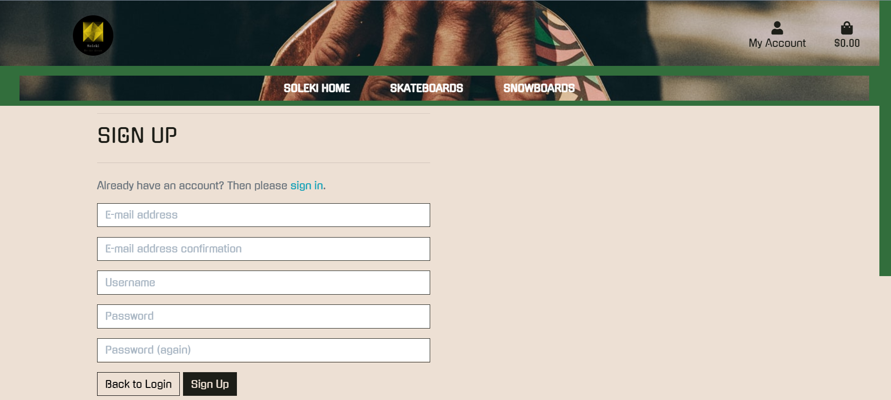

#  #

[SOLEKI](https://soleki.herokuapp.com/) is an e-commerce website where clients, mainly those that skate or snowboard can come and buy various related products.

Soleki is an idea I have had for a skate company since I was a child. Here, people can come and buy skate and snow related products, checkout the skateteam and in the future upload their own footage and maybe join the team.

---

## Contents ##

- [UX](#ux)
  - [Project Goals](#project-goals)
  - [Site Owner Goals](#site-owner-goals)
  - [Site Visitor/User Goals](#site-visitor-user-goals)
  - [User Stories](#user-stories)
  - [User Requirements and Expectations](#user-requirements-and-expectations)
    - [**Requirements**](#--requirements--)
    - [**Expectations**](#--expectations--)
  - [Design Choices](#design-choices)
    - [**Fonts**](#--fonts--)
    - [**Colours**](#--colours--)
- [Wireframes](#wireframes)
- [Information Architecture](#information-architecture)
  - [Database Choice](#database-choice)
  - [Database Modelling](#database-modelling)
    - [**Profile App**](#--profile-app--)
      - [Profile](#profile)
    - [**Product App**](#--product-app--)
      - [Product Category](#product-category)
      - [Product](#product)
    - [**Checkout App**](#--checkout-app--)
      - [Order](#order)
      - [Order Line](#order-line)
    - [**Home App**](#--home-app--)
      - [About Section](#about-section)
      - [Social Media Icons](#social-media-icons)
- [Technologies](#technologies)
  - [Languages](#languages)
  - [Libraries & Frameworks](#libraries---frameworks)
  - [Tools](#tools)
- [Features](#features)
  - [Implemented Features](#implemented-features)
    - [**User Account**](#--user-account--)
    - [**Super User**](#--super-user--)
    - [**Product page**](#--product-page--)
    - [**Skateteam page**](#--skateteam-page--)
    - [**Shopping bag**](#--shopping-bag--)
    - [**Payments**](#--payments--)
  - [Future Features](#future-features)
- [Changes applied since planning](#changes-applied-since-planning)
- [Testing](#testing)
- [Deployment](#deployment)
  - [Local Deployment](#local-deployment)
  - [Deployment to Heroku](#deployment-to-heroku)
  - [Hosting Media files in AWS](#hosting-media-files-in-aws)
- [Credits](#credits)
  - [Images](#images)
  - [Image editing](#image-editing)
  - [Code ideas](#code-ideas)
- [Acknowledgements](#acknowledgements)

---

## UX ##

### Project Goals ###

This project is my final project for the Code Institute's Full stack development programme. The main goal of this project is to create an e-commerce site using Django framework, which is hosted with AWS as well as implementing a fully functional payment system with Stripe.

### Site Owner Goals ###

- Provide the users with a professional e-commerce online shop to allow secure purchases.
- To sell skate and snowboarding products and grow.

### Site Visitor/User Goals ###

- View Snowboards and Skateboards.
- Ability to buy the products online.

### User Stories ###

**Applies to all site users:**

- As a user, I am able to access the site on my mobile, tablet, and desktop which is adapted to provide the best experience.

- As a user, I am able to easily navigate through the website without too much thought and find what I am looking for quickly.

- As a user, I am able to read a description about the products I am interested in (including as images, title etc)

- As a user, I am able to a product to my shopping bag.

- As a user I am  able to register.

- As a user, I am able to change the content of my shopping bag before continuing to completion (add more or remove the products).

- As a user, I am able to see a full breakdown of the total cost, including the shipping charge before proceeding to payment.

- As a user, I am able to purchase the products using my card in a secure environment.

- As a user, I am able to receive an email confirmation once I complete the payment.

**Applies to new site users:**

- As a user, I am able to create an account.

**Applies to all returning users:**

- As a user, I am able to login to my existing account and make a quicker purchase.

- As a user, I am able to view, save and update my personal information.

- As a user, I am able to view past orders.

- As a user, I am able to make purchases quicker by having stored information such as address.

**Applies to a superuser (site owner):**

- As a user, I am able to securely add, edit and delete the information for the specific products on the website.

- As a user, I am able to receive inquiries from the site users after they fill in the contact form straight to my email inbox.

- As a user, I am able to get an email with the customer orders when the purchases are made.

- As a user, I am able to manipulate social media icons in the footer of the site (turn social media icons *on/off* and edit URLs).

- As a user, I am able to access the Django server with /admin and edit the website from there.

[Back to content](#contents)

### User Requirements and Expectations ###

#### **Requirements** ####

- Visually pleasant app design
- Easy site navigation
- Information of the content layed out in a simple and clear way on both mobile and larger screens
- Self-explanatory icons where text is absent

#### **Expectations** ####

- User information is protected by the site
- User can manipulate elements of the particular page
- Get exclusivity once a member on new arrivals and see the Skateteam

[Back to content](#contents)

### Design Choices ###

#### **Fonts** ####

- *All of the site had the universal font below*

  ```font-family: 'Gugi', cursive;```

#### **Colours** ####


[Back to content](#contents)

## Wireframes ##

### **Site Layout** ###

I designed my site moc-ups using [balsamiq wireframes](https://balsamiq.com/).

You can view all wireframes created for this project in [site wireframes](/wireframes/soleki-wf.pdf) folder.

 - The wireframes are a rough draft of the final project as intended.

[Back to content](#contents)

---

## Information Architecture ##

### Database Choice ###

### Database Modelling ###

#### **Profile App** ####

#### **Skateteam App** ####

##### Profile #####

| **Title** | **Database Key** | **Field Type** | **Validation** |
--- | --- | --- | ---
 Username | user | OneToOneField 'User' |  on_delete=models.CASCADE
 Full Name | default_full_name | CharField | max_length=200, null=True, blank=True
 Phone number | default_phone_number | CharField | max_length=20, null=True, blank=True
 Address Line1 | default_address_line1 | CharField | max_length=80, null=True, blank=True
 Address Line2 | default_address_line2 | CharField | max_length=80, null=True, blank=True
 Town/City | default_town_or_city | CharField | max_length=40, null=True, blank=True
 County | default_county | CountryField | blank_label='County', null=True, blank=True
 Postcode | default_postcode | CharField | max_length=20, null=True, blank=True
 Country | default_country | CountryField | blank_label='Country', null=True, blank=True

#### **Product App** ####

##### Product Category #####

| **Title** | **Database Key** | **Field Type** | **Validation** |
--- | --- | --- | ---
Programmatic Name | name | CharField | max_length=50, null=True, blank=False, unique=True
Friendly Name | friendly_name | CharField | max_length=50, null=True, blank=False


##### Product #####

| **Title** | **Database Key** | **Field Type** | **Validation** |
--- | --- | --- | ---
 Product Category | category | ForeignKey 'Category' | null=True, blank=False, on_delete=models.SET_NULL
 Name | name | CharField | max_length=254, null=True, blank=False, unique=True
 Description | description | TextField | max_length=800, null=True, blank=False
 Has sizes | has_sizes | BooleanField | default=False, null=True, blank=True
 Price | price | DecimalField |max_digits=6, decimal_places=2, validators=[MinValueValidator(0.01)]
 Images_url | images_url| URLField'| max_length=1024, null=True, blank=True
 Rating | rating | DecimalField | max_digits=6, decimal_places=2, null=True, blank=True
 Image | image |ImageField| null=True, blank=True
 Sku | sku | CharField | max_length=254, null=True, blank=False
 


 ##### Skateteam #####

| **Title** | **Database Key** | **Field Type** | **Validation** |
--- | --- | --- | ---
 Skateteam Teamcat | teamcat| ForeignKey 'Teamcat' | null=True, blank=False, on_delete=models.SET_NULL
 Name | name | CharField | max_length=254, null=True, blank=False, unique=True
 Description | description | TextField | max_length=800, null=True, blank=False
 Images_url | images_url| URLField'| max_length=1024, null=True, blank=True
 Image | image |ImageField| null=True, blank=True
 Sku | sku | CharField | max_length=254, null=True, blank=False
 Rating | rating | DecimalField | max_digits=6, decimal_places=2, null=True, blank=True


#### **Checkout App** ####

##### Order #####

| **Title** | **Database Key** | **Field Type** | **Validation** |
--- | --- | --- | ---
Order Number | order_number | CharField | max_length=32, null=False, editable=False
Profile | use_profile | ForeignKey 'Profile' | on_delete=models.SET_NULL, null=True, blank=True, related_name='orders'
Full Name | full_name | CharField | max_length=50, null=False, blank=False
Email | email | EmailField | max_length=254, null=False, blank=False
Phone number | phone_number | CharField | max_length=20, null=False, blank=False
Address Line1 | address_line1 | CharField | max_length=80, null=False, blank=False
Address Line2 | address_line2 | CharField | max_length=80, null=False, blank=True
Town/City | town_or_city | CharField | max_length=40, null=False, blank=False
County | county | CharField | max_length=80, null=True, blank=True
Country | country | CountryField | blank_label='Country*', null=False, blank=False
Postcode | postcode | CharField | max_length=20, null=True, blank=True
Purchase Date | purchase_date | DateTimeField | auto_now_add=True
Delivery Cost | delivery_cost | DecimalField | max_digits=6, decimal_places=2, null=False, default=0
Order Total | order_total | DecimalField | max_digits=10, decimal_places=2, null=False, default=0
Grand Total | grand_total | DecimalField | max_digits=10, decimal_places=2, null=False, default=0
Original Bag| original_bag | TextField | null=False, blank=False, default=''
Stripe Pid | stripe_pid | CharField | max_length=254, null=False, blank=False, default=''

##### Order Line #####

| **Title** | **Database Key** | **Field Type** | **Validation** |
--- | --- | --- | ---
Order | order | ForeignKey 'Order' | null=False, blank=False, on_delete=models.CASCADE, related_name='lineitems'
Product | product | ForeignKey 'Product' | null=False, blank=False, on_delete=models.PROTECT
Quantity | quantity | IntegerField | null=False, blank=False, default=1
Line Item Total | line_item_total | DecimalField | max_digits=6, decimal_places=2, null=False, blank=False, editable=False
Datetime | datetime | CharField | null=True, blank=True, max_length=20

[Back to content](#contents)

---  

## Technologies ##

### Languages ###

- [Python3](https://www.python.org/)
  - Used to create the main application functionality
- [HTML5](https://developer.mozilla.org/en-US/docs/Web/HTML)
  - Used as the main markup language for the website content.
- [CSS3](https://developer.mozilla.org/en-US/docs/Web/CSS)
  - Used to style the individual webpages.
- [JavaScript](https://developer.mozilla.org/en-US/docs/Web/JavaScript)
  - Used to create the interactive functionality of the website

### Libraries & Frameworks ###

- [Bootstrap5](https://getbootstrap.com/)
  - Used to design a mobile-first responsive website layout.
- [Django](https://www.djangoproject.com/)
  - A high-level Python Web framework.
- [Django-Allauth](https://django-allauth.readthedocs.io/en/latest/overview.html)
  - Python user authentication and login plugin for Django.
- [Stripe](https://stripe.com/en-gb)
  - Online payments platform used for the shopping basket functionality.
- [Green Unicorn (gunicorn)](https://gunicorn.org/)
  - Python WSGI HTTP Server for Unix used on the Heroku deployment.
- [psycopg2-binary](https://pypi.org/project/psycopg2-binary/)
  - PostgreSQL database adapter for Python.
- [Pillow](https://pillow.readthedocs.io/en/stable/)
  - Python Image Library image processing capabilities.
- [sqlparse](https://pypi.org/project/sqlparse/)
  - sqlparse is a non-validating SQL parser for Python. It provides support for parsing, splitting and formatting SQL statements.
- [Boto3](https://boto3.amazonaws.com/v1/documentation/api/latest/index.html)
  - AWS SDK for Python (Boto3) used to create, configure, and manage AWS S3 services.
- [jQuery](https://jquery.com/)
  - Used for the initialisation of the Bootstrap5 components functionality and enhance the shopping bag functionality.
- [Jinja](https://jinja.palletsprojects.com/en/2.11.x/)
  - Templating language for Python.
- [Google fonts](https://fonts.google.com/)
    - Used to style the entire site.
- [Font-Awesome](https://fontawesome.com/icons?d=gallery)
    - Used to add images to buttons and navbar elements.

### Tools ###

- [PIP](https://pypi.org/project/pip/)
- [Git](https://git-scm.com/)
  - Git was used for version control by utilizing the Gitpod terminal to commit to Git and push to GitHub.
- [GitHub](https://github.com/)
  - Used to store, host and deploy the project files and source code after being pushed from Git.
- [Gitpod](https://www.gitpod.io/)
  - An online IDE linked to the GitHub repository used for the majority of the code development.
- [JSON Formatter](https://jsonformatter.org/)
  - Online JSON Formatter, validator and conversion tool
- [Django Secret Key Generator](https://miniwebtool.com/django-secret-key-generator/)
  - The Django Secret Key Generator is used to generate a new SECRET_KEY for environment variables. 
- [Heroku](https://www.heroku.com/)
    - Heroku is a cloud platform as a service supporting several programming languages. 
- [Boto 3](https://boto3.amazonaws.com/v1/documentation/api/latest/index.html)
- [AWS bucket](https://aws.amazon.com/s3/)
- [Color editor](https://coolors.co/)
- [Favicons](https://fontawesome.com/icons?d=gallery)
- [Balsamiq](https://balsamiq.com/)

 


[Back to content](#contents)

---

## Features ##

Soleki's website is designed using five applications: `Home`, `Products`, `Profiles`, `Skateteam`, `Bag`, and `Checkout`.

### Individual Pages


### Soleki Home


- Landing page for non users

### Soleki Home User


- Landing page for users

### Register


- This page contains a form where users may register. Above the form is a link to Sign in.

### Login

- This page contains a form where users may login. Above the form is a link to Sign up.

### Logout


- Clicking 'Logout' ends a user session and redirects them to the 'Landing' page.

### Products


- This page contains some of the products on the site that users can purchase or browse through.

### Product Detail


- This page contains a description of the product and a button to add it to the shopping bag.

### Checkout


- This page contains the products chosen by the user/client and a form to fill out in order to recieve their purhcase.

### Shopping Bag


- This page contains the place where the products the user chose ready for purchase.

### Skateteam


- This page contains soleki's skateteam, exclusively for registered users.

### Profile


- This page contains past products purchased and a saved form billing address.

### Order infp


- This page contains the verification info after purchase.

### Toast


- This page shows and example of a toast once a user adds a product to the bag in this case.


### Footer page


- This photo shows the footer, that is present on all pages.


# Future Features to Implement


### Implemented Features ###

- The site has **responsive design** when viewed on a mobile, tablet, and desktop.
- **Easy navigation** to external sites, such as social media accounts.
- The user is given feedback when they interact with the website (i.e. when items are added/deleted from the bag, or payment is processed.
#### **User Account** ####

- The users can **create** an account where they can store personal information such as their address and **edit** their details.
- The user can view the skate team and exclusive new arrivals while logged in. They also have a Search-bar to navigate more effeciently.

#### **Super User** ####

- Existing content about the **Products** can be edited, updated, or completely deleted by the **Super User** in the front end.
- The **Super User** can **add new** products  `Shop` sections of the site.
- The **Super User** can see the history of all orders.
- The **Super User** can use the backend to add new products, verify emails or remove a user.

#### **Skateteam page** ####

- This page is only available to registed users, here they can view the skaters and a mini biography about each of them.

#### **Products page** ####

- All of the products listed on this page are available for purchase.

#### **Shopping bag** ####

- Items added to the shopping bag appear in the shopping bag in the navigation part of the header.
- Items can be removed from the shopping bag.
- The user can choose to proceed to payment.

#### **Payments** ####

- Existing users who have previously made a purchase and are logged in, have their delivery address pre-populated when they proceed to payment.
- Checkout page shows the summary of the order.
- Payment can be made by card using Stripe.

### Future Features ###

- The **Super User** can add the skateteam's videos and news about them.
- The **Registered users** can upload their own content and share it with other members.

---

## Changes applied since planning ##

---

## Testing ##

Testing was done manually throughout the development process. The full rundown of the testing can be found in a separate [TESTING.md](TESTING.md) file.

[Back to content](#contents)

---

## Deployment ##

**Soleki** project was deployed using  **Git** and **GitHub** for version control. It is hosted on **Heroku** and all static files, including images, are hosted in **AWS S3 Bucket**. **Stripe** is used for payments and Google's **gMail** for an email account.

Before deploying the application, install the following:

- Python 3
- PIP
- Git
- Heroku CLI

### Local Deployment ###

To deploy Soleki locally, take the following steps:

1. From the applications [repository](https://github.com/AlexNexton/soleki), click the *code* button and download the zip file.

    Alternatively, you can clone the repository using the following line in your terminal:

```terminal
git clone https://github.com/AlexNexton/soleki.git
```

2. Access the folder in your terminal window and install the application's required modules with the following command:

```terminal
pip3 install -r requirements.txt
```

3. Create `env.py` file to hold your environmental variables in the root level of the application:

```python

import os

os.environ.setdefault('STRIPE_SECRET_KEY', 'YOUR_STRIPE_SECRET_KEY')
os.environ.setdefault('STRIPE_PUBLIC_KEY', 'YOUR_STRIPE_PUBLIC_KEY')
os.environ.setdefault('STRIPE_WH_SECRET', 'YOUR_STRIPE_WH_SECRET')
os.environ.setdefault('DATABASE_URL', 'YOUR_DATABASE_URL')
os.environ.setdefault('SECRET_KEY', 'YOUR_DJANGO_SECRET_KEY')
os.environ.setdefault('DEVELOPMENT', '1')
os.environ.setdefault('AWS_S3_REGION_NAME', 'YOUR_REGION')
os.environ.setdefault('AWS_STORAGE_BUCKET_NAME', 'YOUR_BUCKET_NAME')
os.environ.setdefault('STRIPE_CURRENCY', 'YOUR_CURRENCY')
os.environ.setdefault('LANGUAGE_CODE', 'YOUR_LANGUAGE_CODE')
os.environ.setdefault('TIME_ZONE', 'YOUR_TIMEZONE')
os.environ.setdefault('EMAIL_HOST_USER', 'YOUR_EMAIL_USER')
os.environ.setdefault('EMAIL_HOST_PASSWORD', 'YOUR_EMAIL_PASSWORD')
os.environ.setdefault('EMAIL_HOST', 'smtp.google.com') # if you use gmail 

```

If you plan to make your repository public, ensure you add `.env` file to `.gitignore` before committing.

4. If your IDE terminal, migrate the models to create the database using the following commands:

```terminal
python manage.py makemigrations
python manage.py migrate
```

5. Create a superuser to access the admin panel using the following command:

```terminal
python manage.py createsuperuser
```

Then follow the instructions to create the superuser.

6. After you login to the admin panel, you can add data to be displayed in your `PRODUCT` apps. Refer to [database modeling](#database-modelling). Alternatively, you can use fixtures, follow below command to load data into the database in the following order:

`PRODUCT APP`:

`product_categories`, `collections`, `tags`, `images`, `images_folder` and only then `products`.


```terminal
python manage.py loaddata <fixture_name>

```
Be sure to load the Categories before the Products to ensure no future errors occur.

7. To initiate the application, type the command `python manage.py runserver` in your terminal. The application is now available in your browser at the address: `http://localhoset:8000`

[Back to content](#contents)

### Deployment to Heroku ###

To deploy the app to Heroku, use the following steps:

1. Ensure you have the following dependancies installed in your app, such as PostgressSQL driver for Python, WSHI HTTP Server and dj database url that connects the the app with the database:

```terminal
pip3 install psycopg2-binary

pip3 install install gunicorn

pip3 install dj_database_url
```

2. If you haven't already, create `requirements.txt` file containing all of the dependancies:

```terminal
pip3 freeze > requirements.txt
```

3. Create a `Procfile` that contains the following: `web: gunicorn soleki.wsgi:application`.
4. Push these newly created files to your repository master.
5. Login to Heroku and create a new app.
6. In Heroku dashboard of the new app, click **deploy**, then **deployment** method and select **GitHub** to connect your app to your github repository for automatic deployment.
7. In Heroku Resources tab, navigate to **Add-Ons** section and search for **Heroku Postgres**. I recommend you choose hobby level for this application.
8. In settings tab, navigate to **Reveal Config Vars** and add the following variables:

| **KEY**               | **VALUE**                          |
| --------------------- | -----------------------------------|
| AWS_ACCESS_KEY_ID     | ACCESS_KEY_ID_PROVIDED_BY_AWS      |
| AWS_S3_REGION_NAME    | REGION_PROVIDED_BY_AWS             |
| AWS_SECRET_ACCESS_KEY | SECRET_ACCESS_KEY_PROVIDED_BY_AWS  |
| AWS_STORAGE_BUCKET    | STORAGE_BUCKET_PROVIDED_BY_AWS     |
| DATABASE_URL          | YOUR_DATABASE_URL                  |
| EMAIL_HOST            | smtp.google.com (if using gmail)   |
| EMAIL_HOST_PASS       | YOUR_EMAIL_PASSWORD                |
| EMAIL_HOST_USER       | YOUR_EMAIL_USER                    |
| LANGUAGE_CODE         | YOUR_LANGUAGE_CODE                 |
| SECRET_KEY            | YOUR_DJANGO_SECRET_KEY             |
| STRIPE_CURRENCY       | YOUR_STRIPE_CURRENCY               |
| STRIPE_PUBLIC_KEY     | YOUR_STRIPE_SECRET_KEY             |
| STRIPE_SECRET_KEY     | YOUR_STRIPE_PUBLIC_KEY             |
| STRIPE_WH_SECRET      | YOUR_STRIPE_WH_SECRET              |
| TIME_ZONE             | YOUR_TIME_ZONE                     |
| USE_AWS               | True                               |

9. In settings.py in your IDE, temporarily comment out the database and use below code instead (make sure you do not commit!):

```python
DATABASES = {
        'default': dj_database_url.parse('POSTGRESS URL')
    }
```

10. In terminal, migrate the models to create the Postgress database using the following commands:

```terminal
python manage.py makemigrations
python manage.py migrate
```

11. Create a superuser to access the admin panel using the following command:

```terminal
python manage.py createsuperuser
```

Then follow the instructions to create the superuser.

12. After you login to the admin panel, you can add data to be displayed in your app for `HOME` and `PRODUCT` apps. Refer to [database modeling](#database-modelling). Alternatively, you can use fixtures, follow below command to load data into the database in the following order:

`PRODUCT APP`:

`product_categories`, `collections`, `tags`, `images`, `images_folder` and only then `products`.

`HOME APP`:

`about_section`, `social_media_icons`.

```terminal
python manage.py loaddata <fixture_name>
```

13. Remove the temporary database from settings.py and uncomment the original code, then push the code to origin.
14.  Back to in **Heroku dashboad**, deploy the application.
15.  To view the site, click on **View App**.

### Hosting Media files in AWS ###

The *static* and *media files* are hosted in the [AWS S3 Bucket](https://aws.amazon.com/). To host them, you need to create an account in AWS and create your S3 basket with **public access**. More about setting it up you can read in [Amazon S3 documentation](https://docs.aws.amazon.com/AmazonS3/latest/gsg/CreatingABucket.html) and this [tutorial](https://django-storages.readthedocs.io/en/latest/backends/amazon-S3.html).

[Back to content](#contents)

---

## Credits ##

### Images ###

### Image editing ###

- I have used the snippet tool for capturing screengrabs which I saved as images.
- I have also used [giphy.com](https://giphy.com/) to convert MP4 video files to gif files used in Testing.md.
- [Image size editor](https://tinyjpg.com/)
- [Video Compressor](https://www.freeconvert.com/video-compressor)
- [Videezy](https://www.videezy.com/free-video/lithuania-sea?page=3&from=mainsite&in_se=true) for video content on the home page.

### Code ideas ###

- [Code Institute](https://codeinstitute.net/full-stack-software-development-diploma/) Course material - in particular the code from the Boutique Ado Django mini project
- [Stack Overflow](https://stackoverflow.com/)
- README template, ideas adapted from [Neringa Bickmore](https://github.com/neringabickmore/art-ial)
- README template, ideas adapted from [Simon Vardy](https://github.com/simonjvardy)
- README template, ideas adapted from my past projects too.


[Back to content](#contents)

---

## Acknowledgements ##

I'd like to say thank you to everyone who has supported me throughout this project:

- My Family- thank you so much for everything!
- The Slack community - you are without a doubt all heros!
- Thank you Code Institute for everything!
- A huge thank Student care, especailly to Alexander at Code Institute - you truely are an amazing human being!
- And finally, a special thanks to my mother Caroline - you are my rock moms!!

[Back to content](#contents)
