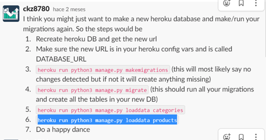

# Soleki Testing Details #

[Main README.md file](https://github.com/AlexNexton/soleki/blob/master/README.md)

[View the live project here.](https://soleki.herokuapp.com/)

---

## Table of Contents ##

- [Automated Testing](#automated-testing)
  - [Validation Services](#validation-services)
- [Manual Testing](#manual-testing) 
  - [Testing undertaken on desktop](#testing-undertaken-on-desktop)
  - [Testing undertaken on tablet and phone devices](#testing-undertaken-on-tablet-and-phone-devices)
  - [User Stories Testing](#user-stories-testing)
- [Bugs discovered](#bugs)
  - [Resolved bugs](#resolved-bugs)
  - [Unsolved Bugs](#unsolved-bugs)

---
## Automated Testing ##
 
### Validation Services ###

The following **validation services** and **linter** were used to check the validity of the website code.

- [W3C Markup Validation](https://validator.w3.org/) was used to validate HTML.
- [W3C CSS validation](https://jigsaw.w3.org/css-validator/) was used to validate CSS.
- [JSHint](https://jshint.com/) was used to validate JavaScript.
- [Chrome DevTools Lighthouse](https://developers.google.com/web/tools/lighthouse) is an open-source, automated tool for improving the quality of web pages. You can run it against any web page, public or requiring authentication. It has audits for performance, accessibility, progressive web apps, SEO and more.

---
## Manual Testing ##
--- 
 
### Testing undertaken on desktop ###

- Hardware:
    - Macbook Pro Laptop
    -  HP laptop
    - Dell 5590 Laptop
- Tested Operating Systems:
    - Windows 10
    - OSX 10.11          
- Tested Browsers:
    - Windows 10:
        - Chrome
        - Firefox
        - Edge 
    - OSX 10.11
        - Chrome
        - Firefox
        - Safari  

### Testing undertaken on tablet and phone devices ###

- Hardware:
    - iPad Pro 12.9"
    - iPad Pro 10.5"
    - iPhone XS Max
    - samsung a50
- Tested Operating Systems:
    - iOS 13.5.1
    - iPadOS 13.5.1
    - Android 10 with One UI 2.0
- Tested Browsers:
    - iOS / iPadOS
        - Chrome
        - Firefox
        - Edge

## Code testin ##

- Tested Python code

---
## User Stories Testing ##
---

- an example of tested user stores below

- As a user, I am able to access the site on my mobile, tablet, and desktop which is adapted to provide the best experience.

    1. Search for https://soleki.herokuapp.com/ on any device.
    2. Enjoy your shop!
    

- As a user, I am able to easily navigate through the website without too much thought and find what I am looking for quickly.

    - Thanks to the navbar and quick links, moving around the website is effortless, especially once registerd where you get a search bar too.

- As a user I am  able to register.

    1. Go to the Nav-bar, which is rendered on all pages.
    2. Looking at the Nav-bar, click the icon that looks like a person.
    3. Fill out the from.
    4. Click 'Sign up' button to finish creating profile page.

- As a user, I am able to change the content of my shopping bag before continuing to completion (add more or remove the products).

    1. Go to Products and add an item for your choose.
    2. Select as many as you would like to purchase and then click add to bag.
    3. Here, you can update or remove items.
    

- As a user, I am able to receive an email confirmation once I complete the payment

     1. Go to the products page and add an item to your bag.
     2. Choose the number of items you wish to purchase and click the checkout button.
     3. Fill out the form and enter your credit card number.
     4. Click Order. A confirmation email will be sent to the email address provided by the user.
     

- As a **user**, I want to be able to access the site's if any **Social Media** platforms.

    1. Go to any page.
    2. Scroll down to the very bottom.
    3. Click Instagram.
    4. Here (if the site were real) you can view all of the websites merchandise.

#### Bugs ####

### Resolved bugs ###

- Inicially had problems rendering photos from the s3 AWS Bucket to the deployed website.
    - Added the media (hadn't seen the video) aand this solved the problem.
- I had trouble logging into Heroku from Gitpod as taught in the video. It returned a missing ip address text.
    - Thanks to slack, I found out you can write ' heroku login -i'  into the terminal and this solved the problem.
- Stripe would not hook up to gitpod and I was unable to render 'success' message in the terminal as taught in the videos on the Boutique-ado project.
    - I solved this by making the 8000 port public.
- My background image was not rendering and I honselty did everything but the most logical thing to try and get it to work.
    - I realise I had not uploaded the photo to the s3 Bucket.
- None of my app files in Skateteam where connecting to django. I tried everything I could think of but to no avail. I did not think I was going to solve this issue.
    - I went to slack and found the greatest comment ever written to date and this solved everything  - I did happy dance! 

#### Unsolved Bugs ####

- When a user signs in and hits the back page they are brought back to the login page yet if they hit the forward key are still logged in.
- Alternatively, if a user signs out but hits the back button at times they still have access to their profile.

